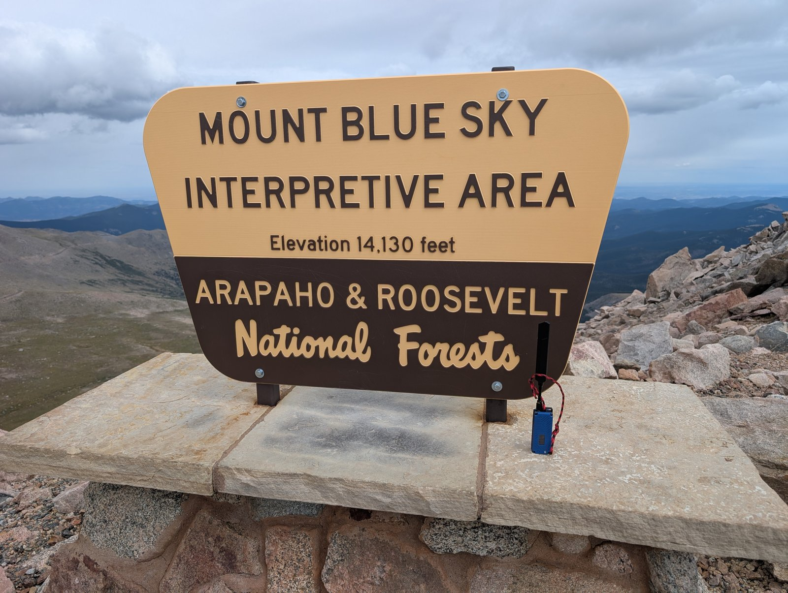
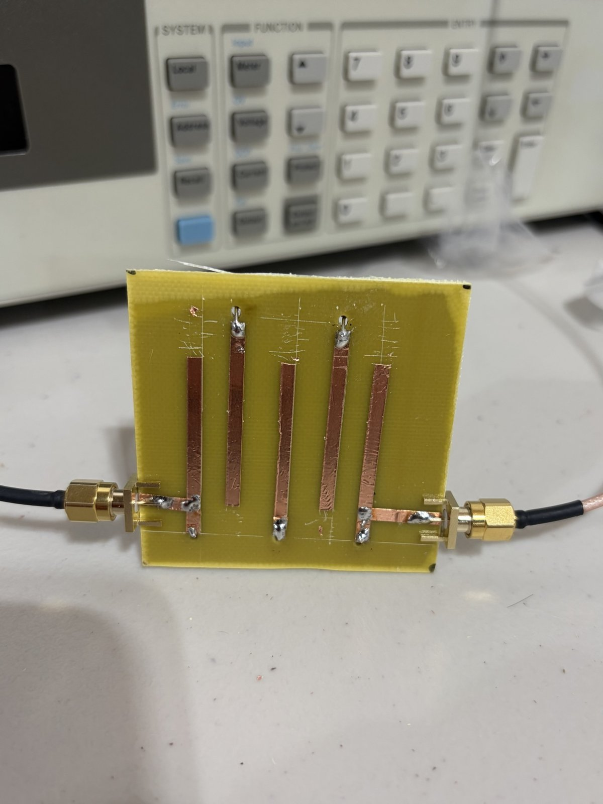

<!--
FIRST ISSUE (Aug + Sept 2026 catch-up) — composed from candidates-aug-sep.json
(Aug 1 – Sep 16 window). Facts from gathered data; bracketed CONFIRM notes below = human-verify.
Deeper multi-sentence detail per DESIGN.md. Run dedup-check.py before publishing.
Future issues scope to the single prior month.
-->

# Colorado Mesh Monthly — August & September 2026

> Hey folks, and welcome to the very first Colorado Mesh Monthly. Since this is
> our kickoff and we're publishing mid-month, we're reaching back across both
> August and September so nobody misses the good stuff. Going forward this lands
> once a month — but for now, settle in: it was a huge two months. We linked the
> mesh across state lines into Nebraska, kept pushing the Denver metro onto
> MediumFast, started seriously mapping out regional "scopes," and welcomed a
> genuinely wonderful flood of new operators. Here's the recap, sorted by protocol
> so you can jump straight to your corner of the mesh.

## General News

- **We crossed over 1,000 Discord members**, and the pace of new arrivals hasn't slowed. Between August and September the introductions channel was one of the busiest in the whole server. If you're new: welcome, and don't be shy about asking where to put your first node.
- **A community reminder on airtime etiquette.** As the network grows, the public channels saw a spike in automated traffic — bots broadcasting every few seconds, plus the occasional commercial or crypto spam. Rin (R-4) asked everyone to keep automated messages to no more than once every few hours (a once-a-morning weather post is fine; every 30 minutes is not), and to keep commercial broadcasts off the public channels entirely. LoRa airtime is tiny and shared by everyone, so a little restraint keeps the whole mesh usable.
- **A community configuration tool consolidation.** The group standardized on https://tools.meshcore.coloradomesh.org as the primary config tool and deprecated the older site, streamlining how people set up and manage nodes.
- **A town hall may be in the works.** Zeva floated the idea of an online town hall to make up for the lack of recent in-person gatherings, and JohnnyW5KV has been vocal about wanting regular meetups. Nothing's scheduled yet — but if the interest is there, say so in the channels and help shape the format.

## Events & Meetups

- **BARCFest — October 4 (Boulder Amateur Radio Club).** Colorado Mesh is planning to attend BARCFest, the Boulder Amateur Radio Club's hamfest. It's a great chance to meet folks behind the callsigns in person — and there's been talk of asking BARC about hosting a mesh repeater on one of their tower sites, so it could be more than a social visit. Details: https://barcw0dk.wordpress.com
- **Parker Radio Association** held its monthly meeting on September 7 with a presentation on AllStar (via JohnnyW5KV). Keep an eye on announcements for the next one.
- **Weekly Net — every Thursday.** There's no dedicated channel: just post to the MeshCore Public channel any time on Thursday and you're checked in. New this cycle, Old Man Malice wired the net into MeshWars so your check-in earns credit there too.

## Photo / Video of the Month

Caption: On the summit of Mt Blue Sky (14,130 ft), M0TH3R logged which repeaters heard — and were heard by — a node at the top of Colorado. Photo: M0TH3R, Aug 31. [Two landscape options (B/C) and a portrait (A) are in issues/2026-09/photos/contact-sheet.html — open it in a browser to switch.]

## Meshtastic

- **The MediumFast migration is the big Meshtastic story.** The Denver metro is steadily moving from LongFast to MediumFast for better performance, and Lookout Mountain shifted its presets to nudge people toward MediumFast. Adoption is still uneven — plenty of nodes outside the metro remain on LongFast, and there's healthy discussion about the range tradeoffs — so check what your area is actually running before you switch. Legacy LongFast bridging is being wound down. (Runr, TickleMeTemplar, nwithan8) https://coloradomesh.org/news/mediumfast-changeover
- **A cross-protocol bridge experiment.** nwithan8 ran a live test bridging Meshtastic (LongFast) and MeshCore (Public) in the Denver area to see what actually crosses between the networks. The finding: Meshtastic traffic in range was light enough that there wasn't much worth bridging — useful data for how (and whether) to link the two going forward.

## MeshCore

- **We're meshing across state lines.** A working path along I-76 now links the Colorado mesh to Nebraska — an advert from a node near DIA was heard as far as Ogallala. It's a genuine milestone: coverage has grown from a metro network into something that reaches past the state border. (nwithan8)
- **"Scopes" — defining our regions.** With the network sprawling, a new #scopes channel spun up to plan and standardize MeshCore region definitions. The current proposal leans toward county-based scopes rather than IATA airport codes for better geographic accuracy, and nwithan8 has been coordinating with Nebraska, Utah, and Wyoming so the scheme stays compatible across state lines. Community input is wanted before anything is locked in. (Rin R-4, Zeva, nwithan8)
- **Observers are filling in the map.** New observers came online across the state — including Grand Junction — feeding the MQTT relay and the analyzer so we can actually see how the network is growing. A naming tool was added to help operators label nodes to convention, and folks in under-covered regions are encouraged to stand up an observer and report in. (nwithan8, Zeva)
- **New repeaters keep lighting up.** Among them, mrpatzy placed one near Brittany Hill with strong line-of-sight to Denver and the mountains, and more are planned around Grand Junction. Every well-placed node makes the whole mesh more reliable.

## Reticulum

- **Work on the Lookout bridge.** omgitsgela has been configuring a bridge up on Lookout Mountain — a WiFi repeater for remote access, MQTT bridging, and local mirroring of MediumFast and LongFast, with a second radio planned to add LongFast support. It's a meaningful step toward tying the high-site infrastructure together. Watch the channels for how it comes along.
- **Reticulum is drawing real interest.** By Rin (R-4)'s rough read, community interest splits about 65% MeshCore, 20% Meshtastic, and 14% Reticulum — and the Reticulum share is growing. danlbarron shared Alpine Linux guides and install scripts to make standing up a node easier, and Zeva posted a Docker config for a NomadNet transport node. Bridging software to link Reticulum with Meshtastic and MeshCore is also in play.
- **Under-the-hood work continues.** There's ongoing discussion of packet handling and flow control (the Rust implementation uses a bounded queue with flow control; Python's is unbounded), plus a set of Reticulum sidecar patches Rin (R-4) shared for anyone who wants to contribute: https://github.com/Colorado-Mesh/mesh-client/tree/main/reticulum-sidecar/patches

## Get the Mesh Client

New here, or still juggling separate apps? The community maintains **Mesh Client** — a free, cross-platform desktop app (Windows, macOS, Linux) that speaks Meshtastic, MeshCore, *and* Reticulum from one window, so you don't need a different tool for each protocol. It's actively developed — a big thanks to Joey (NV0N), its lead developer, and the contributors — and it's the easiest way to manage your nodes and follow the mesh from a real screen. Grab it at github.com/Colorado-Mesh/mesh-client and give it a spin.

## For Sale & Wanted

- No member classifieds came in this cycle. A couple of build resources worth a look, though: Zeva shared a Printables model for a 1-watt low-profile solar mesh car node, and pointed to the RAK3401 1W LoRa booster kit on the RAKwireless store. _Got gear to sell or a part you're hunting for? Drop it in the channel and we'll list it here next month._

## Call to Action

**We need Reticulum full repeaters in high spots — build yours now!** High-elevation nodes are what turn scattered coverage into a real network, and Reticulum full transport nodes on ridges and rooftops are exactly where we're thin. If you've got a good vantage point, tower access, or a solar setup you've been meaning to deploy, this is the single highest-leverage thing you can do for the mesh right now. Ask in the channels — budt W0RMT and others have offered to help with repeater setup, and the wiki has the configuration docs.

## Community Spotlight

Shout-out to **Iguy**, who stood up a brand-new repeater near Lexington and Union in Colorado Springs — balcony-mounted, solar plus battery, at 6,810 ft. That "just put one up and see what happens" energy is exactly how the mesh grows, one rooftop at a time. And a nod to **Zeva**, whose fingerprints are all over this cycle: region definitions, observer onboarding, config tooling, and a steady stream of technical help in the channels. Welcome to the map, Iguy — and thanks, Zeva.

Bonus build spirit of the month: beala hand-fabricated a 900 MHz bandpass filter from a PCB and copper tape — the VNA showed a real filter, just with (beala's words) a hilarious 33 dB of insertion loss. Not shippable yet, but exactly the kind of tinkering that makes this community fun.

## Around the Web

- beala's writeup on the FCC and using 500 kHz bandwidth — a genuinely good technical deep-dive: https://beala.substack.com/p/the-fcc-want-me-to-use-more-bandwidth
- JohnnyW5KV's video reviews of mesh gear (the PeakMesh Climber, among others) on YouTube.
- A new coloradomesh.org news page on the 2-byte path changeover is in progress (KFØUFO - Andrew) — https://coloradomesh.org/news/2-byte

## Story of the Month: Meshing the Divide

If these two months had a single theme, it was *reach*. Back in August, the network was still largely a Front Range affair — a cluster of nodes trading packets between the foothills and the metro. By mid-September, the map told a different story: messages were routinely finding their way to the far corners of the state and, for the first time, spilling clean across a state line (you'll find the specifics up in the MeshCore section).

What's worth sitting with isn't any one hop — it's how it happened. Nobody flipped a switch. It was the cumulative payoff of dozens of small, unglamorous acts: a node zip-tied to a balcony, an observer quietly reporting from a town nobody had covered yet, a preset nudged on a mountaintop, and an awful lot of people comparing notes about antennas and coax loss at 900 MHz. That's the whole trick to a community mesh — it doesn't scale by decree, it scales by people deciding, one rooftop at a time, that their corner of Colorado belongs on the map. Not bad for a pile of low-power radios and a shared stubbornness about coverage.

## Sources & Further Reading

- Colorado MeshCore analyzer / live map — https://analyzer.meshcore.coloradomesh.org
- Meshtastic live map — https://map.meshtastic.coloradomesh.org
- MeshCore config tools — https://tools.meshcore.coloradomesh.org
- MediumFast changeover — https://coloradomesh.org/news/mediumfast-changeover
- 2-byte path changeover — https://coloradomesh.org/news/2-byte
- Colorado MeshCore Regions (wiki) — https://wiki.coloradomesh.org/wiki/Colorado_MeshCore_Regions
- MeshCore MQTT / running an observer (wiki) — https://wiki.coloradomesh.org/wiki/MeshCore_MQTT
- Weekly Net check-in — https://weekly-net.meshcore.coloradomesh.org
- Donate to keep the network running — https://coloradomesh.org/donate
- Join / getting started — https://coloradomesh.org

## Until Next Month

That's the catch-up. From here we'll land once a month, covering the prior month.
If you lit up a repeater, printed an enclosure, ran a great wardrive, or finally
beat a stubborn SNR — tell us, so it lands in the next issue. Big or small, we
want it.

**Nerd Joke of the Month:** Why did the LoRa packet bring a ladder to the net? It heard the best check-ins come from *high* SNR.

**The Prize:** this month's giveaway is a **RAKwireless WisBlock Meshtastic Starter Kit (US915)** — the RAK19007 Base + RAK4631 Core — bundled with a **RAK12501 GNSS location tracker module**. Everything you need to build a GPS-equipped Meshtastic node from scratch. Starting next month we'll draw a random winner from everyone who reacts to the newsletter in Discord — so react to this issue to be entered!

**73**
